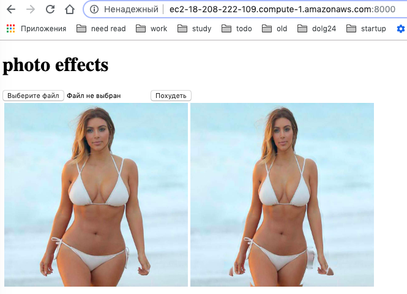
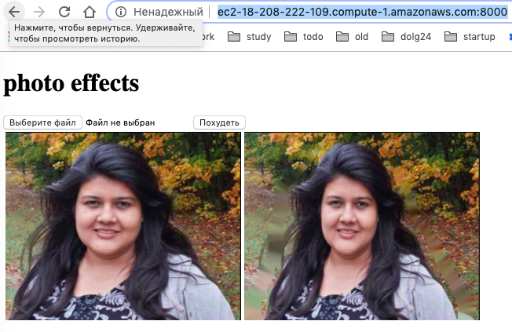

# photolab_slim

## install requirements

    pip install cython numpy scipy sklearn tensorflow keras jupyter pandas scikit-image imgaug pycocotools matplotlib django

    mkdir lib
    git clone https://github.com/matterport/Mask_RCNN.git
    cd Mask_RCNN/
    python setup.py install
    
    python app/initial.py

    python photolab/manage.py migrate
    python photolab/manage.py runserver 0.0.0.0:8000

